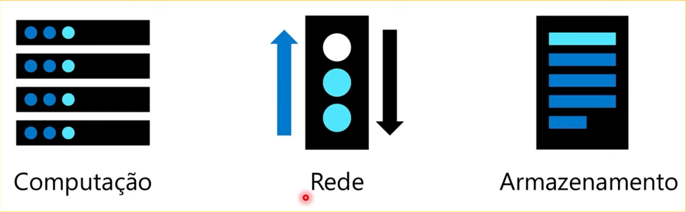

# ☁️ Azure Cloud Fundamentals


## 📖 Sobre o Projeto

Minha jornada de aprendizado em Computação em Nuvem e Microsoft Azure.



Este repositório foi criado para registrar meus estudos, anotações, desafios de código, laboratórios e projetos práticos desenvolvidos ao longo da minha evolução na plataforma Microsoft Azure.

Além do aprendizado em Cloud Computing, este projeto também é utilizado para praticar versionamento com Git e GitHub através de branches, commits e Pull Requests.

---

## 🎯 Objetivos

* Aprender os fundamentos de Computação em Nuvem
* Conhecer os principais serviços da Microsoft Azure
* Desenvolver projetos práticos na nuvem
* Praticar versionamento com Git e GitHub
* Construir um portfólio de estudos em Cloud Computing

---

## 📚 Conteúdo do Projeto

### 📘 Módulo 1 - Fundamentos de Cloud Computing

* ☁️ Computação em Nuvem
* 🌎 Modelos de Nuvem
* 🚀 Benefícios da Nuvem
* ⚙️ IaaS, PaaS e SaaS
* 🔐 Modelo de Responsabilidade Compartilhada
* 📈 SLA (Service Level Agreement)
* 🖥️ Portal Microsoft Azure

---

## 📈 Progresso dos Estudos

### Fundamentos de Cloud Computing

* [❌] Computação em Nuvem
* [❌] Modelos de Nuvem
* [❌] Benefícios da Nuvem
* [❌] IaaS, PaaS e SaaS
* [❌] Responsabilidade Compartilhada
* [❌] SLA
* [❌] Portal Azure

---

## 📂 Estrutura do Projeto

```text
azure-cloud-fundamentals/
│
├── README.md
│
├── docs/
│   ├── cloud-computing.md
│   ├── cloud-models.md
│   ├── cloud-benefits.md
│   ├── service-models.md
│   └── azure-portal.md
│
├── code/
│   ├── desafio-1-if-else.py
│   └── desafio-2-dicionario.py
│
└── images/
    ├── azure-portal.png
    ├── cloud-computing.png
    ├── hybrid-cloud.png
    ├── iaas.png
    ├── paas.png
    ├── private-cloud.png
    ├── public-cloud.png
    ├── saas.png
    ├── shared-responsibilitu-model.png
    └── sla.png
       
```
## 📄 Documentação

| Documento                                     | Descrição                                              |
| --------------------------------------------- | ------------------------------------------------------ |
| [cloud-computing.md](docs/cloud-computing.md) | Conceitos básicos de Computação em Nuvem               |
| [cloud-models.md](docs/cloud-models.md)       | Modelos de Nuvem Pública, Privada e Híbrida            |
| [cloud-benefits.md](docs/cloud-benefits.md)   | Benefícios da Computação em Nuvem                      |
| [service-models.md](docs/service-models.md)   | IaaS, PaaS, SaaS, SLA e Responsabilidade Compartilhada |
| [azure-portal.md](docs/azure-portal.md)       | Navegação e conceitos do Portal Azure                  |

---

## 💻 Desafios de Código

Esta seção reúne exercícios desenvolvidos em Python com foco na simulação de cenários reais de computação em nuvem utilizando serviços da Microsoft Azure.

O objetivo é praticar lógica de programação, estruturas de decisão e otimização de código, aplicando conceitos fundamentais de arquitetura em cloud computing e mapeamento de regras de negócio.

---

## ☁️ Azure Service Selector

O desafio consiste em identificar automaticamente qual serviço Azure deve ser utilizado com base em uma necessidade informada pelo usuário.

Esse tipo de problema simula situações reais em ambientes de TI e cloud, onde diferentes demandas precisam ser direcionadas para serviços específicos de forma rápida e eficiente.

---

## 🧪 Desafio 1 — Estrutura Condicional (if / elif / else)

Nesta primeira abordagem, a solução é construída utilizando estruturas condicionais sequenciais para verificar a entrada do usuário e retornar o serviço correspondente.

📄 Arquivo:

[desafio-1-if-else.py](/code/desafio-1-if-else.py)

---

## 🧪 Desafio 2 — Mapeamento com Dicionário (dict)

Nesta segunda abordagem, a solução utiliza um dicionário Python para realizar o mapeamento direto entre a necessidade informada pelo usuário e o serviço Azure correspondente.

Essa abordagem simula um padrão muito utilizado em sistemas reais, onde estruturas de chave-valor são aplicadas para otimizar consultas e simplificar regras de negócio.

📄 Arquivo:

[desafio-2-dicionario.py](/code/desafio-2-dicionario.py)

---

## 🔀 Estratégia de Versionamento

Este projeto utiliza uma estrutura simples baseada em Git Flow para organização dos estudos e evolução do conteúdo.

### Branches

```text
main
│
└── develop
    │
    └── feature/*
```

### Fluxo de Trabalho

1. Criar uma branch de funcionalidade a partir da `develop`
2. Realizar alterações e commits
3. Enviar a branch para o GitHub
4. Abrir Pull Request para `develop`
5. Realizar o merge após a revisão
6. Ao final de cada módulo, realizar merge de `develop` para `main`

---

## 📌 Status

🟡 Em desenvolvimento

Este repositório será atualizado continuamente conforme avanço nos estudos, laboratórios e projetos práticos utilizando Microsoft Azure.
