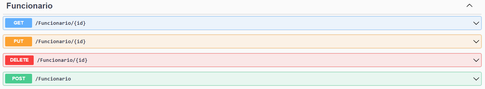

# 👨‍💼 Employee Management API


API REST desenvolvida com ASP.NET Core para gerenciamento de funcionários, utilizando Entity Framework Core para persistência de dados e Azure Table Storage para auditoria de alterações.

Este projeto foi desenvolvido como parte dos meus estudos em Microsoft Azure e .NET, aplicando conceitos de APIs REST, CRUD, banco de dados relacional, auditoria de dados e integração com serviços em nuvem.

---

## 📖 Sobre o Projeto

O sistema permite o gerenciamento de funcionários através de operações de cadastro, consulta, atualização e remoção de registros.

Além do armazenamento dos dados em banco relacional, todas as alterações realizadas são registradas em logs de auditoria utilizando Azure Table Storage.

---

## 🎯 Objetivos

* Desenvolver uma API REST utilizando ASP.NET Core
* Implementar operações CRUD
* Utilizar Entity Framework Core para persistência de dados
* Aplicar conceitos de Azure SQL Database
* Aplicar conceitos de Azure Table Storage
* Documentar a API com Swagger
* Praticar versionamento com Git e GitHub

---

## ☁️ Arquitetura da Solução

A aplicação segue uma arquitetura simples baseada em API REST.

Fluxo principal:

```text
Cliente
   │
   ▼
ASP.NET Core Web API
   │
   ├── SQL Database
   │      └── Dados dos Funcionários
   │
   └── Azure Table Storage
          └── Logs de Auditoria
```

---

## 🏛️ Arquitetura Tecnológica

```text
Frontend
└── Swagger UI

Backend
└── ASP.NET Core Web API

Persistência
├── SQL Database
└── Azure Table Storage

ORM
└── Entity Framework Core
```

---

## 🖼️ Diagramas e Capturas

### 📊 Diagrama de Classes

Representação das entidades utilizadas na aplicação.


---

### ☁️ Arquitetura da Solução

Fluxo de comunicação entre a API, banco de dados e armazenamento de logs.


---

### 📚 Swagger

Documentação automática dos endpoints disponibilizados pela API.



---

## 📂 Estrutura do Projeto

```text
employee-management-api/
│
├── Controllers/
│   └── FuncionarioController.cs
│
├── Context/
│   └── RHContext.cs
│
├── Models/
│   ├── Funcionario.cs
│   ├── FuncionarioLog.cs
│   └── TipoAcao.cs
│
├── Migrations/
│   ├── 20220623031755_Initial.cs
│   ├── 20220623031755_Initial.Designer.cs
│   └── RHContextModelSnapshot.cs
│
├── Properties/
│   └── launchSettings.json
│
├── Images/
│   ├── diagrama_api.png
│   ├── diagrama_classe.png
│   └── swagger.png
│
├── Program.cs
├── appsettings.json
├── appsettings.Development.json
└── EmployeeManagementApi.csproj
```

---

## 👤 Modelo de Dados

### Funcionario

```json
{
  "nome": "Nome funcionário",
  "endereco": "Rua 123",
  "ramal": "1234",
  "emailProfissional": "email@empresa.com",
  "departamento": "TI",
  "salario": 1000,
  "dataAdmissao": "2022-06-23T02:58:36.345Z"
}
```

### Propriedades

| Campo             | Tipo           |
| ----------------- | -------------- |
| Id                | int            |
| Nome              | string         |
| Endereco          | string         |
| Ramal             | string         |
| EmailProfissional | string         |
| Departamento      | string         |
| Salario           | decimal        |
| DataAdmissao      | DateTimeOffset |

---

## ✅ Funcionalidades Implementadas

### 👨‍💼 Gerenciamento de Funcionários

* Criar funcionários
* Buscar funcionário por ID
* Atualizar dados
* Remover registros

### 📑 Auditoria

* Registrar inclusões
* Registrar atualizações
* Registrar remoções
* Armazenar histórico em Azure Table Storage

---

## 🔄 Endpoints

| Método | Endpoint            |
| ------ | ------------------- |
| GET    | `/Funcionario/{id}` |
| POST   | `/Funcionario`      |
| PUT    | `/Funcionario/{id}` |
| DELETE | `/Funcionario/{id}` |

### Exemplo de Requisição

#### POST /Funcionario

```json
{
  "nome": "Nome funcionário",
  "endereco": "Rua 123",
  "ramal": "1234",
  "emailProfissional": "email@empresa.com",
  "departamento": "TI",
  "salario": 1000,
  "dataAdmissao": "2022-06-23T02:58:36.345Z"
}
```

---

## 🗄️ Persistência de Dados

### SQL Database

Os funcionários são armazenados em banco de dados relacional utilizando Entity Framework Core.

Tabela:

```text
Funcionarios
```

Campos:

```text
Id
Nome
Endereco
Ramal
EmailProfissional
Departamento
Salario
DataAdmissao
```

---

### Azure Table Storage

Os logs de auditoria são armazenados em:

```text
FuncionarioLog
```

Campos principais:

```text
PartitionKey
RowKey
TipoAcao
JSON
Timestamp
ETag
```

---

## 📦 Pacotes Utilizados

```text
Azure.Data.Tables
Microsoft.EntityFrameworkCore
Microsoft.EntityFrameworkCore.SqlServer
Microsoft.EntityFrameworkCore.Design
Swashbuckle.AspNetCore
```

---

## 🛠️ Tecnologias Utilizadas

* C#
* ASP.NET Core 6
* Entity Framework Core
* SQL Server
* Azure Data Tables SDK
* Swagger
* Microsoft Azure
* Git
* GitHub

---

## 🚀 Executando o Projeto

### Restaurar dependências

```bash
dotnet restore
```

### Configurar Connection Strings

Preencha os arquivos:

* appsettings.json
* appsettings.Development.json

Exemplo:

```json
{
  "ConnectionStrings": {
    "ConexaoPadrao": "<SQL_CONNECTION_STRING>",
    "SAConnectionString": "<AZURE_STORAGE_CONNECTION_STRING>",
    "AzureTableName": "FuncionarioLog"
  }
}
```

### Aplicar Migrations

```bash
dotnet ef database update
```

### Executar aplicação

```bash
dotnet run
```

### Abrir Swagger

```text
https://localhost:<porta>/swagger
```

---

## 📚 Conceitos Aplicados

Durante o desenvolvimento deste projeto foram aplicados conceitos relacionados a:

* APIs REST
* CRUD
* ASP.NET Core
* Controllers
* Entity Framework Core
* Migrations
* SQL Server
* Azure SQL Database
* Azure Table Storage
* Swagger/OpenAPI
* Persistência de Dados
* Auditoria de Registros
* Git e GitHub

---

## 🔀 Estratégia de Versionamento

Este projeto segue uma estratégia simples baseada em Git Flow.

```text
main
│
└── develop
    │
    └── feature/*
```

### Fluxo Utilizado

1. Criar branch a partir da `develop`
2. Implementar a funcionalidade
3. Realizar commits
4. Enviar para o GitHub
5. Abrir Pull Request
6. Realizar merge em `develop`
7. Publicar versão em `main`

---

## 📖 Contexto

Este projeto foi desenvolvido durante minha jornada de aprendizado em Computação em Nuvem e Microsoft Azure.

O objetivo foi aplicar na prática conceitos relacionados a:

* ASP.NET Core Web API
* Entity Framework Core
* CRUD
* Azure SQL Database
* Azure Table Storage
* Swagger
* Versionamento com Git e GitHub

A arquitetura implementada segue os requisitos propostos no desafio original, servindo como demonstração prática dos conhecimentos adquiridos durante os estudos.

---

## 📌 Status

✅ Concluído

Projeto desenvolvido para fins educacionais durante os estudos de Microsoft Azure e .NET.

### Funcionalidades implementadas

* CRUD de Funcionários
* Persistência com Entity Framework Core
* Migrations
* Logs de auditoria com Azure Table Storage
* Swagger/OpenAPI
* Documentação técnica
* Diagramas de arquitetura
* Versionamento com Git e GitHub
* Integração com serviços do Microsoft Azure