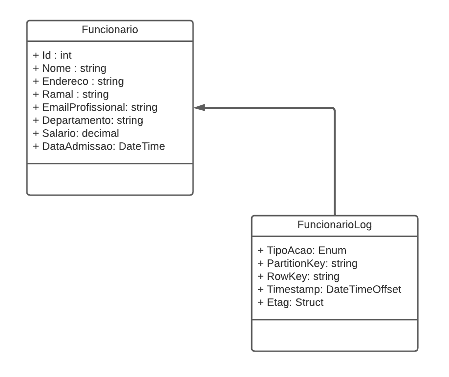
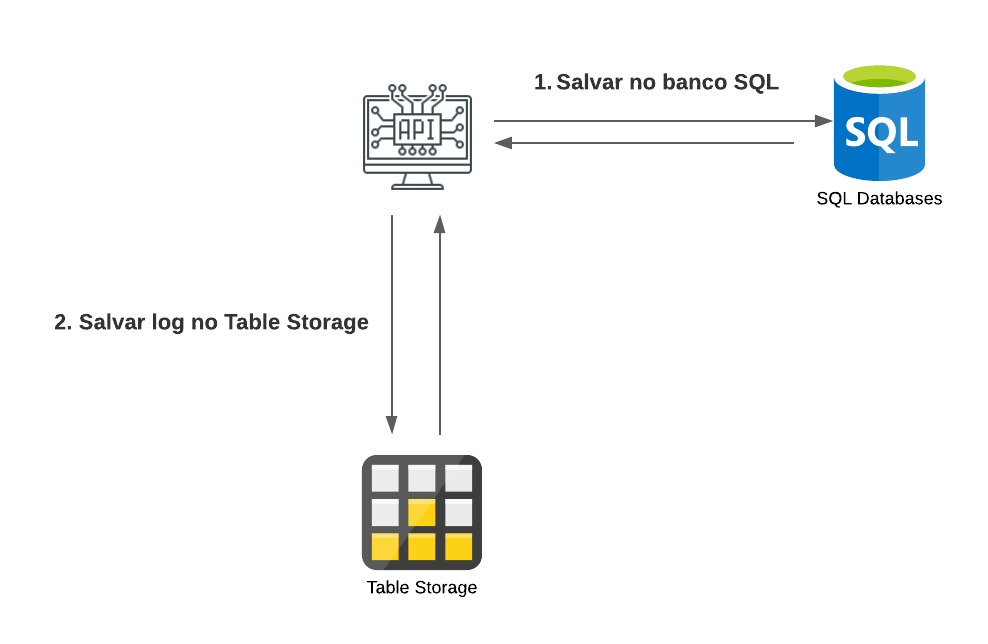

# 👨‍💼 Employee Management API

API REST desenvolvida com ASP.NET Core para gerenciamento de funcionários, utilizando Entity Framework Core para persistência de dados e Azure Table Storage para auditoria de alterações.

Este projeto foi desenvolvido como parte dos meus estudos em Microsoft Azure e .NET, aplicando conceitos de APIs REST, CRUD, banco de dados relacional, auditoria de dados e integração com serviços em nuvem.

---

## 📖 Sobre o Projeto

O sistema permite o gerenciamento de funcionários através de operações de cadastro, consulta, atualização e remoção de registros.

Além do armazenamento dos dados em banco relacional, todas as alterações realizadas são registradas em logs de auditoria utilizando Azure Table Storage.

---

## 🎯 Objetivos

* Desenvolver uma API REST utilizando ASP.NET Core
* Implementar operações CRUD
* Utilizar Entity Framework Core para persistência de dados
* Aplicar conceitos de Azure SQL Database
* Aplicar conceitos de Azure Table Storage
* Documentar a API com Swagger
* Praticar versionamento com Git e GitHub

---

## 🖼️ Diagramas e Capturas

### 📊 Diagrama de Classes

Representação das entidades utilizadas na aplicação.



---

### ☁️ Arquitetura da Solução

Fluxo de comunicação entre a API, banco de dados e armazenamento de logs.



---

## 👤 Modelo de Dados

### Funcionario

```json
{
  "nome": "Nome funcionário",
  "endereco": "Rua 123",
  "ramal": "1234",
  "emailProfissional": "email@empresa.com",
  "departamento": "TI",
  "salario": 1000,
  "dataAdmissao": "2022-06-23T02:58:36.345Z"
}
```

### Propriedades

| Campo             | Tipo           |
| ----------------- | -------------- |
| Id                | int            |
| Nome              | string         |
| Endereco          | string         |
| Ramal             | string         |
| EmailProfissional | string         |
| Departamento      | string         |
| Salario           | decimal        |
| DataAdmissao      | DateTimeOffset |

---

## 🗄️ Persistência de Dados

### SQL Database

Os funcionários são armazenados em banco de dados relacional utilizando Entity Framework Core.

Tabela:

```text
Funcionarios
```

Campos:

```text
Id
Nome
Endereco
Ramal
EmailProfissional
Departamento
Salario
DataAdmissao
```
---

## 📋 Funcionalidades

### Funcionários

* Cadastro de funcionários
* Consulta por ID
* Atualização de dados
* Exclusão de registros

---

## 🔄 Endpoints

### Buscar Funcionário

```http
GET /Funcionario/{id}
```

### Cadastrar Funcionário

```http
POST /Funcionario
```

Body:

```json
{
  "nome": "Nome funcionário",
  "endereco": "Rua 123",
  "ramal": "1234",
  "emailProfissional": "email@empresa.com",
  "departamento": "TI",
  "salario": 1000,
  "dataAdmissao": "2022-06-23T02:58:36.345Z"
}
```

### Atualizar Funcionário

```http
PUT /Funcionario/{id}
```

### Remover Funcionário

```http
DELETE /Funcionario/{id}
```

---

### Auditoria

Toda alteração gera automaticamente um registro de log contendo:

* Tipo da ação executada
* Dados completos do funcionário
* Departamento relacionado
* Data e hora da operação

---

### Azure Table Storage

Os logs de auditoria são armazenados em:

```text
FuncionarioLog
```

Campos principais:

```text
PartitionKey
RowKey
TipoAcao
JSON
Timestamp
ETag
```

---

## 📦 Pacotes Utilizados

```text
Azure.Data.Tables
Microsoft.EntityFrameworkCore
Microsoft.EntityFrameworkCore.SqlServer
Microsoft.EntityFrameworkCore.Design
Swashbuckle.AspNetCore
```

---

## 🛠️ Tecnologias Utilizadas

* C#
* ASP.NET Core 6
* Entity Framework Core
* SQL Server
* Azure Data Tables SDK
* Swagger
* Microsoft Azure
* Git
* GitHub

---

## 🏗️ Banco de Dados

Migration inicial criada para geração da tabela:

```text
Funcionarios
```

Estrutura gerada através do Entity Framework Core.

---
